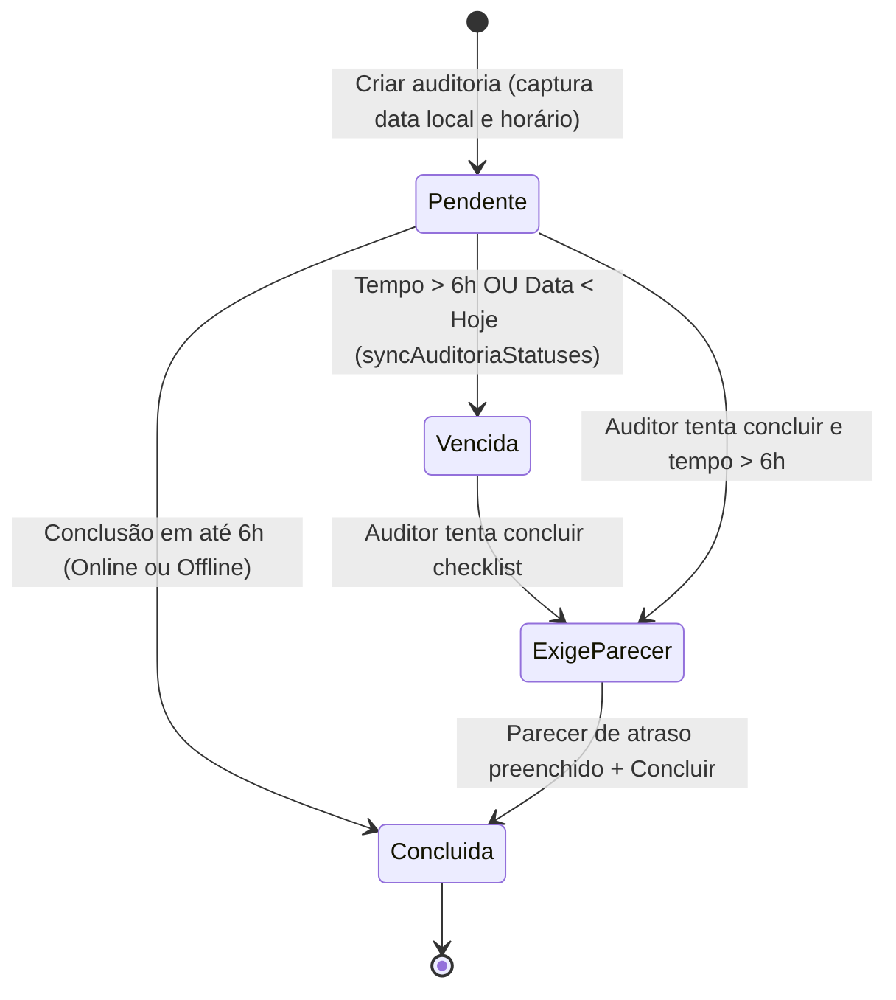

# Documentação Técnica: Sistema de Horários, Prazos e Rotinas

Esta documentação descreve o funcionamento, regras de negócio, modelo de dados e arquitetura técnica do **Sistema de Horários, Prazos (SLA) e Rotinas de Vistoria** do aplicativo **Rota de Incêndio**.

---

## 1. Visão Geral

O sistema gerencia o ciclo temporal das vistorias de segurança contra incêndio, contemplando:
- **Escala e Rotina Fixa Semanal:** Definição prévia do dia e horário padrão para a vistoria de cada auditor.
- **Rastreabilidade de Abertura:** Registro da data local e hora exata em que o checklist é iniciado.
- **Controle de SLA (Prazo Limite de 6 Horas):** Monitoramento contínuo para evitar que vistorias fiquem abertas indefinidamente.
- **Justificativa de Atraso (Parecer Obrigatório):** Bloqueio de finalização de vistorias vencidas até que o auditor registre um parecer formal.
- **Resiliência Offline:** Preservação fidedigna do horário de encerramento e justificativa mesmo sem conexão à internet.
- **Orientação Proativa no Dashboard:** Identificação dinâmica do dia da semana atual com alerta em tempo real e atalho rápido caso hoje seja o dia agendado do auditor.

---

## 2. Modelo de Dados

### A. Tabela `public.auditores`

Armazena os dados cadastrais do auditor e sua escala de rotina:

| Coluna | Tipo | Descrição |
|---|---|---|
| `dia_vistoria` | `text` | Dia fixo da semana atribuído ao auditor (ex.: `"Segunda-feira"`, `"Sexta-feira"`). |
| `horario_vistoria` | `text` | Horário de referência no formato `HH:mm` (ex.: `"16:00"`). |

### B. Tabela `public.auditorias`

Registra cada execução individual de checklist:

| Coluna | Tipo | Descrição |
|---|---|---|
| `data_auditoria` | `date` | Data local da vistoria no padrão ISO (`YYYY-MM-DD`). |
| `horario_abertura` | `time` | Hora local em que o auditor clicou em "Salvar" (`HH:mm:ss`). |
| `aberta_em` | `timestamptz` | Timestamp completo com timezone do momento de abertura no servidor. |
| `concluida_em` | `timestamptz` | Timestamp completo de quando a vistoria foi finalizada (online ou offline). |
| `status` | `text` | Status atual: `'pendente'`, `'concluida'` ou `'vencida'`. |
| `parecer_atraso` | `text` | Justificativa do auditor caso a vistoria tenha estourado o SLA de 6h ou a data limite. |
| `parecer_atraso_em` | `timestamptz` | Data e hora em que o parecer foi submetido. |
| `parecer_atraso_auditor_id` | `uuid` | Chave estrangeira para o auditor que assinou a justificativa. |

---

## 3. Ciclo de Vida e Regras de Negócio

### 3.1. Cadastro da Rotina Semanal
- **Onde:** `/admin/auditores` (`SuperAdminAuditoresClient.tsx`).
- O Super Admin define a Unidade, Setor, um dos 7 dias da semana e o horário de início (padrão `16:00`).
- A rotina é exibida como `"Toda [Dia] às [Horário]"`.

### 3.2. Abertura da Auditoria
- **Onde:** `/auditorias/nova` (`nova/page.tsx`).
- A tela exibe um card com a **Rotina Semanal Programada** do auditor logado.
- No momento do envio:
  - `data_auditoria` é gerada pela função `getLocalDateISO()` (garantindo o dia civil local correto, independentemente de fusos como UTC-3 após as 21h).
  - `horario_abertura` armazena a hora local `HH:mm:ss`.
  - `aberta_em` grava o timestamp ISO de referência.

### 3.3. Regra de SLA e Vencimento Automático
A função `syncAuditoriaStatuses` em `src/services/auditorias.ts` é acionada antes de carregar listagens, dashboards ou badges de notificação:
1. **Auditorias de dias anteriores:** Qualquer auditoria com `status = 'pendente'` e `data_auditoria < data_local_hoje` é atualizada para `'vencida'`.
2. **Prazo de 6 horas:** Qualquer auditoria com `status = 'pendente'` aberta há mais de 6 horas (`aberta_em < now() - 6h`) é atualizada para `'vencida'`.

### 3.4. Parecer de Atraso Obrigatório
Tanto na tela do checklist (`/checklist/[id]`) quanto na listagem de auditorias:
- Se uma auditoria estiver vencida ou com mais de 6 horas de abertura, o sistema bloqueia a conclusão direta.
- O botão abre um modal exigindo o preenchimento de **Parecer sobre atraso**.
- Ao salvar o parecer, são preenchidos `parecer_atraso`, `parecer_atraso_em` e `parecer_atraso_auditor_id`.

### 3.5. Resiliência e Conclusão Offline
- No modo offline, o auditor pode preencher os itens e concluir a auditoria.
- Os metadados de conclusão (`concluida_em`, `parecer_atraso`, etc.) são salvos no IndexedDB/LocalStorage através da fila `queueConcluir()`.
- Ao retornar a conexão, o `syncAuditoriaQueue()` sincroniza as respostas e grava a auditoria como `"concluida"` preservando o horário exato em que o auditor encerrou no dispositivo.

---

## 4. Alertas e Escala no Dashboard

No Dashboard principal (`/dashboard`):
- O componente `AlertsPanel` analisa a escala do auditor autenticado em relação ao dia da semana retornado por `getDiaSemanaAtual()`:
  - **Se hoje for o dia agendado (e a vistoria ainda não foi aberta):**
    - Exibe banner de destaque amarelo: *"Hoje é o seu dia de vistoria!"* informando o horário programado.
    - Exibe o botão de ação rápida: **"Iniciar vistoria agora"** (redireciona para `/auditorias/nova`).
  - **Se hoje for o dia agendado (e a vistoria já foi realizada):**
    - Exibe indicador verde: *"Vistoria de hoje concluída / aberta"*.
  - **Se for outro dia:**
    - Exibe lembrete informativo com a próxima rotina fixa.

---

## 5. Funções Utilitárias Principais

Disponíveis em [`src/lib/utils.ts`](file:///c:/Projects/Thales/rota-incendio/src/lib/utils.ts):

| Função | Assinatura | Finalidade |
|---|---|---|
| `getLocalDateISO` | `(date?: Date) => string` | Retorna `YYYY-MM-DD` com base na data local (elimina o salto prematuro de dia causado por `toISOString()` em fusos negativos como UTC-3). |
| `formatDateBR` | `(value: string \| null) => string` | Converte com segurança strings de data `YYYY-MM-DD` para o formato brasileiro `DD/MM/YYYY`. |
| `formatTime24` | `(value: string \| null) => string` | Converte o tipo `time` do Postgres (`"14:30:00"`) para exibição 24h (`"14:30"`). |
| `getDiaSemanaAtual` | `(date?: Date) => string` | Retorna o dia da semana atual por extenso em português (`"Segunda-feira"`, etc.). |

---

## 6. Boas Práticas para Desenvolvedores

1. **Nunca utilize `new Date().toISOString().slice(0, 10)` para salvar ou comparar `data_auditoria`:**
   - Em fusos como Brasília (UTC-3), após as 21:00 o método UTC já reporta o dia seguinte. Use sempre `getLocalDateISO()`.
2. **Não ignore os metadados ao modificar a fila offline:**
   - Ao estender a funcionalidade de conclusão offline, certifique-se de manter o repasse do objeto `ConclusaoOfflineMeta`.
3. **Gerenciamento de Auditores:**
   - Utilize sempre a rota `/admin/auditores` (a rota antiga `/auditores` redireciona automaticamente para ela).
